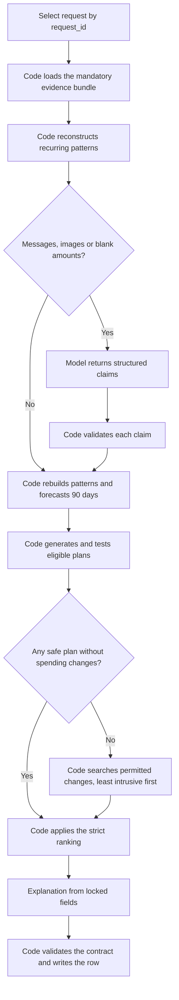

# Harness architecture: what is deterministic and what is not

This document records the division of responsibility implemented in
[`code/harness/`](../harness). The rules come from
[problem_statement.md](../../problem_statement.md) and [AGENTS.md](../../AGENTS.md);
the calibration figures come from the 25 answers in `dataset/sample_requests.csv`.

**Code guarantees evidence coverage and financial correctness. The model
interprets ambiguous evidence. The model never produces an amount, a date, a
payment method or a plan that reaches `output.csv`.**

## Flow

## Division of responsibility

| Responsibility | Owner | Why |
|---|---|---|
| Identify request and user | Code | IDs already establish ownership; inference adds risk |
| Load profile, events, offers, messages and image metadata | Code | Missing one obligation can invalidate the recommendation |
| Interpret multilingual messages | Model | Meaning and amendments require contextual interpretation |
| Extract image amounts, separate payable from paid | Model | Receipts have varied layouts and ambiguity |
| Validate interpreted facts | Code | Unsupported changes must not enter the ledger silently |
| Apply FX, dates and monetary arithmetic | Code | Exact, repeatable calculations |
| Detect recurrence | Code proposes patterns; model flags exceptions | Repetition alone can mistake a commission or a final payroll for salary |
| Forecast balances and test plans | Code | Every payment must satisfy the same safety rules |
| Rank eligible plans | Code | The challenge defines the ordering explicitly |
| Explain the recommendation | Template by default, model optional | The published answers use one tight house style |

## Baseline evidence is always loaded

`harness/ledger.py` builds a bundle per request containing the profile, every
financial event for the user, the supplied payment options, every message known
by the request date, and the linked image metadata. Nothing depends on the model
choosing to call a tool. Unusual rows are classified rather than discarded: each
carries an explicit exclusion reason (`cancelled_transaction`,
`pending_credit_not_yet_cash`, `unrealized_valuation`, and so on) so the reason a
record did or did not count is recoverable.

The samples show why coverage has to be structural:

- `request_04`: omitting the message could turn an unapproved bonus into income.
- `request_16`: missing the receipt would omit the outstanding rent balance.
- `request_20`: reading only the main bill would miss the late-payment amount.
- `request_12`: capacity to pay in full does not authorise full payment.

## The model returns claims, not ledger edits

`harness/interpret.py` sends one JSON-schema-constrained turn per request with
evidence to read, and gets back claims in a fixed vocabulary
(`income_stream_ends`, `income_amount_change`, `income_date_change`,
`recurring_expense_amount_change`, `new_recurring_expense`, `exclude_projection`,
`event_amount`, `exclude_event`, `no_material_effect`).

`harness/facts.py` checks ownership, schema, dates, categories, amounts and
source existence before any claim can move a flow. Those checks cannot prove the
model read a message correctly, so two further rules carry the financial risk:

- **A cash-increasing claim is discarded unless it is marked confirmed.** A
  confidence score never authorises unsupported income. Claims that reserve cash
  apply either way, which is the financially safer reading.
- **Employment income can only be stopped by a claim that names the pattern and
  is scoped to the stream.** A note about an unapproved bonus or a one-off
  arrears line beside a normal payslip cannot delete the salary.

Unresolved questions stay visible in `code/evaluation/evidence_audit.jsonl`
alongside every refused claim and its refusal reason.

## Model calls are earned, not routine

`needs_model` skips the call entirely when a request has no message, no image and
no blank amount. On the evaluation set that is 50 of 250 requests, which cost no
tokens at all. The remaining 200 take one call each.

## The prompt is not the workflow

The earlier tool-loop agent enforced its workflow only through instructions: the
loop accepted final text whenever the model stopped calling tools, without
establishing that every event page had been read or that a forecast had passed.
In the harness the sequence is code, so the guarantees hold regardless of what
the model does — including doing nothing, which is what a degraded request falls
back to.

## Calibration

`code/evaluate_samples.py` scores the harness against the published answers
(read for scoring only; the solution never sees those columns).

| Field | Deterministic | With interpretation |
|---|---:|---:|
| `affordability_status` | 21/25 | 22/25 |
| `recommended_payment_method` | 22/25 | 23/25 |
| `payment_plan` | 21/25 | 21/25 |
| `earliest_date_for_full_payment` | 20/25 | 21/25 |
| `spending_changes_needed` | 22/25 | 22/25 |
| All five fields exact | 18/25 | 19/25 |
| Mean relative error on `amount_safe_to_pay` | 0.072 | 0.031 |

Policy choices that the samples drove, all in `RecurrencePolicy` and
`SAFETY_WINDOW` so they stay inspectable: a pattern needs two occurrences; the
per-occurrence estimate is the mean; a pattern more than 1.5 periods stale has
lapsed; payroll wordings collapse into one income stream while bonuses, gig
payouts and a second household income stay separate; same-day credits land
before debits.

## Defects the calibration found

Six forecast defects surfaced by decomposing each disagreement into
`(balance - minimum) - drawdown` and comparing against the implied truth. Each is
pinned by a test class in `code/tests/test_forecast_fixes.py`.

| Defect | Symptom | Fix |
|---|---|---|
| Cadence destroyed by a gap | Payroll interrupted by leave gives gaps [31, 91]; the median 61 falls outside the recurring range, so the salary vanished. 8 requests had no income at all. | Recover the base period when every gap is a near-whole multiple of the smallest |
| Income the history cannot establish | One prorated first payslip plus a message confirming the real amount and date. No claim type could create an income stream. 6 requests had no income. | Added `new_recurring_income`, which is cash-increasing and so requires confirmation |
| One-off row absorbed into a pattern | A scheduled "Outstanding rent balance" joined the rent pattern and re-timed and re-priced it. | Only confirmed future *credits* extend a pattern; future debits stay standalone flows |
| Wrong safety window | `earliest_date_for_full_payment` and plan feasibility were judged over the full 90 days, so request_08, request_12 and request_13 found no safe date where the samples do. | Judge a payment over the request's completion window; keep `amount_safe_to_pay` a 90-day measure |
| Obligation due today dropped | A monthly commitment whose next occurrence lands exactly on the request date was skipped, understating request_19's drawdown by a full month of rent. | Project occurrences from the request date inclusive; they are always after the last recorded one |
| Cuts never compared against a late plan | A no-change plan that finishes after the deadline short-circuited the spending-change search, although completing on time outranks avoiding a cut. | Search changes whenever the best no-change plan is late, then rank both together |

Two things the calibration ruled *out* rather than fixed. Projected debits track
the previous 90 days of settled debits to within 1.3%, so the expense model is
unbiased; and although the statement asks for conservative variable-spend
forecasting, every estimator above the plain mean (`mean3`, `max3`, the 60th to
80th percentile) left the field agreement unchanged and made the amount error
worse. The `variable_estimator` knob keeps that result reproducible.

## What still disagrees

Six of the 25 samples still differ, and none is a rule difference any more.
Scaling every projected debit by a factor and solving for the factor that
reproduces the sample's `amount_safe_to_pay` shows the residue is 1-3% of
variable-spend estimation landing on the wrong side of a threshold: request_06,
request_11 and request_21 turn on whether a permitted cut is needed at all, and
request_03, request_17 and request_19 differ only in a date or the amounts inside
an otherwise correct plan.
