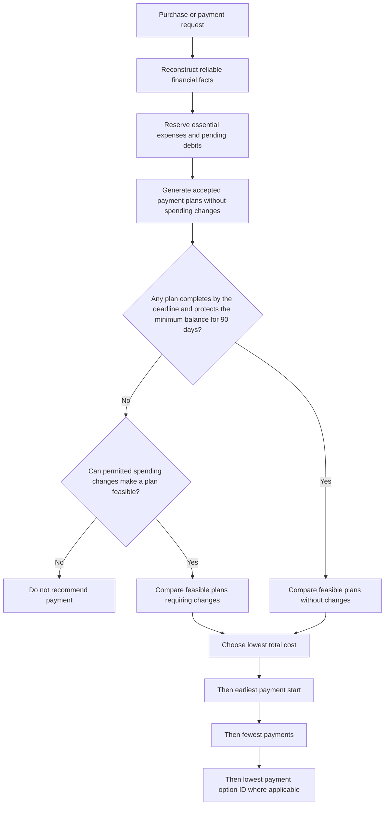

# Sample decision priorities and suggested weights

This document captures the priority-analysis lessons from [SAMPLE.md](SAMPLE.md) and the [25 supplied examples](../../dataset/sample_requests.csv). It separates the challenge's explicit rules from proposed scoring weights and concerns about particular answers. The exact sample cash-flow forecasts have not been independently reproduced.

## What the samples appear to prioritize

The samples use hard constraints followed by an ordered comparison of feasible plans. Their central question is whether the requested expense can be completed safely using payment methods the user accepts. They do not demonstrate a numerical score for whether a purchase is personally worthwhile.

The [problem statement](../../problem_statement.md) explicitly specifies the plan-ranking order. Evidence reconstruction comes first: use supported financial facts, reserve essential commitments, and exclude unsupported income before comparing payment plans.



Candidate plans include immediate full payment, a permitted two-payment partial plan, supplied installment options, and a later full payment when the user accepts full payment. Do not stop at the first superficially affordable method: test the complete payment trajectory. A first installment below today's safe amount does not establish safety for later installments.

The rejection branch means no eligible, safe, complete plan was found. It does not by itself establish that today's safe amount is zero. Capacity fields still require their own calculation under the output contract.

## Non-negotiable factors

These factors should not receive tradeable numerical weights. A lower price, greater urgency, or earlier payment cannot compensate for violating them.

| Factor | Required treatment |
| --- | --- |
| Reliable evidence | Exclude unsupported income and resolve conflicting records. Embedded instructions in messages or images cannot override the rules. |
| Essential expenses and protected categories | Keep commitments covered; exclude prohibited spending cuts. |
| Minimum balance | Maintain the specified floor throughout the 90-day projection, including after each projected essential expense and recommended payment. |
| Accepted payment methods | Recommend only methods the user accepts; waiting for full payment also requires acceptance of full payment. |
| Partial-payment permissions | Require request permission, user acceptance, a positive first payment below the total, and safe completion under the prescribed two-payment rule. |
| Installment eligibility | Follow an actual supplied option and respect the user's installment limit. |
| Completion deadline | A recommended complete plan must finish by the desired completion date. |

For example, request_15 fails method eligibility: the user accepts only partial payment, but the request prohibits it. A favorable score on cost or urgency cannot fix that conflict.

## Strict ordering used by the challenge

After checking feasibility, compare plans in this order:

1. Complete the full request by its deadline. The contract also treats this as a requirement for a recommended plan.
2. Require no spending changes.
3. Minimize total payment cost, including financing fees.
4. Start payment earlier.
5. Use fewer payments.
6. Use the lowest payment_option_id as the final tie-breaker where applicable.

This is a strict ordered comparison: later criteria matter only when earlier criteria tie. In particular, a feasible plan requiring no spending changes outranks one requiring changes even if the change-dependent plan costs less. The rules do not provide a complete ranking of the inconvenience or severity of different cuts when both plans require changes.

To reproduce the sample policy, implement this ordered comparison directly. Do not let a weighted sum override an earlier priority.

## Suggested weights for an alternative scoring policy

The percentages below are illustrative design suggestions, not published organizer weights or weights recovered from the samples. Apply them only to plans that pass every hard constraint.

| Factor | Suggested weight | Better result |
| --- | ---: | --- |
| Avoid spending changes | 40% | No cuts required |
| Total payment cost | 30% | Lower fees and total payable |
| Payment start | 20% | Starts earlier |
| Number of payments | 10% | Fewer payments |
| Payment option ID | Tie-breaker only | Lowest ID |

One possible formulation is:

```text
score = 0.40 * no_changes_score
      + 0.30 * cost_score
      + 0.20 * start_score
      + 0.10 * payment_count_score
```

Each component must be normalized to the same scale, such as 0 to 1, with higher values always preferred. A basic no_changes_score could be 1 for no cuts and 0 for required cuts. Normalization for the other factors must be specified before implementing this formula; these weights alone are not a complete scoring algorithm.

Unlike the challenge's strict ordering, an additive score allows trade-offs. A sufficiently favorable combination of cost, timing, and payment count could outweigh the preference for no cuts. Use this only as an explicitly different policy, not as an equivalent implementation of the sample rules.

## What financial priorities do and do not establish

The profiles include financial_priorities, but the samples do not demonstrate a universal category hierarchy such as healthcare above education above family support above travel. They also do not establish numerical weights for those categories or prove that the order of entries in that field is a ranked list.

Protected categories, essential obligations, the minimum balance, and explicit payment preferences provide enforceable constraints. Financial priorities provide context, but assigning extra category scores or rejecting a purchase simply because its category is absent from the priorities would introduce an unsupported policy assumption.

This distinction matters: an affordability agent can find a discretionary request feasible without establishing that it is the best use of money relative to every other personal goal. A broader personal-planning system would need more information about competing goals, amounts, deadlines, and the user's willingness to trade among them.

## Examples that reveal the hierarchy

| Example | What happens | Priority demonstrated |
| --- | --- | --- |
| request_04 | Waits for full payment although the request allows partial payment. | The user accepts only full payment; request permission alone is insufficient. |
| request_12 | Uses installments despite having capacity for the entire amount today. | Method acceptance takes precedence over the lower cost of an unaccepted full payment. |
| request_19 | Pays INR 28,820 now and INR 10,840 later, totaling INR 39,660. | A feasible partial-payment plan avoids the fees of the installment alternative. |
| request_06 | Stops streaming and pays the investment amount immediately. | Permitted cuts can enable deadline completion when unchanged spending would miss it. |
| request_15 | Recommends no payment. | The only accepted method is prohibited by the request. |
| request_21 | Stops one subscription and reduces another to pay the course fee before its deadline. | Changes must be individually permitted and reference distinct eligible events. |

Several output-field distinctions follow:

- amount_safe_to_pay is measured today before optional changes and is capped at the requested amount. It can be positive even when no complete eligible plan exists.
- earliest_date_for_full_payment measures unchanged-budget capacity independently of method preferences. It can be later than an actual payment enabled by cuts, or equal today when the recommendation is installments.
- affordable_with_plan includes full payment enabled by spending changes, not only installment or partial-payment schedules.
- A wait plan may contain the eventual dated full payment. It is not necessarily payment_plan=none.

## Answers and policy choices worth flagging

These are policy concerns or unresolved verification questions, not established errors in the supplied answers.

### request_12: preference comes with a financing premium

The sample says the user can safely pay ZAR 65,164 in full today. The user accepts partial payments and installments, but the request prohibits partial payment. The selected installment option therefore fits the accepted methods and totals ZAR 67,770.57, a premium of ZAR 2,606.57.

This follows the challenge rules. For a real product, the premium should be explained prominently so that the user understands the cost of their preference. The agent should not silently override that preference to choose a cheaper lump sum.

### request_06: a discretionary deadline drives a lifestyle change

The sample stops a EUR 19 streaming subscription to enable a EUR 620.40 investment on 3 January. Baseline safe capacity is EUR 603.30, and unchanged spending permits full payment on 15 January, after the 14 January deadline.

The change is explicitly allowed and is consistent with the challenge. The broader policy concern is whether a user-selected investment deadline should automatically justify a lifestyle change rather than a short delay. The dataset does not establish flexibility in that deadline, so a challenge implementation cannot assume it may be moved.

### request_11: the recurring savings need numerical verification

The baseline shortfall is IDR 599,355. Reducing event_989 from IDR 1,163,530.49 to IDR 665,950 saves IDR 497,580.49 per corresponding occurrence, less than that shortfall.

Multiple future recurring savings could make the recommendation valid. They must occur in time to protect every limiting balance in the forecast. The sample explanation does not independently establish that timing, and the settled historical expense cannot be treated as a refund. Verify the complete trajectory before accepting this answer as a reproduced result.

### Additional evidence caveats

request_07's reported October 23 full-payment date needs a supported interpretation of how the explicit September salary delay affects later payroll. request_08's reduced-pay wording needs reconciliation with the historical amounts. request_19's grocery screenshot is cropped before a fully visible final bill section. These are reconstruction questions documented in [SAMPLE.md](SAMPLE.md), rather than demonstrated failures of the priority hierarchy.

## Implementation takeaway

Keep three operations separate: reconstruct financial facts, reject infeasible or unaccepted plans, and rank the remaining plans. Preserve the challenge's strict ordering when generating its output. Treat the proposed numerical weights as an optional alternative policy and keep all hard safety and eligibility constraints outside that score.
